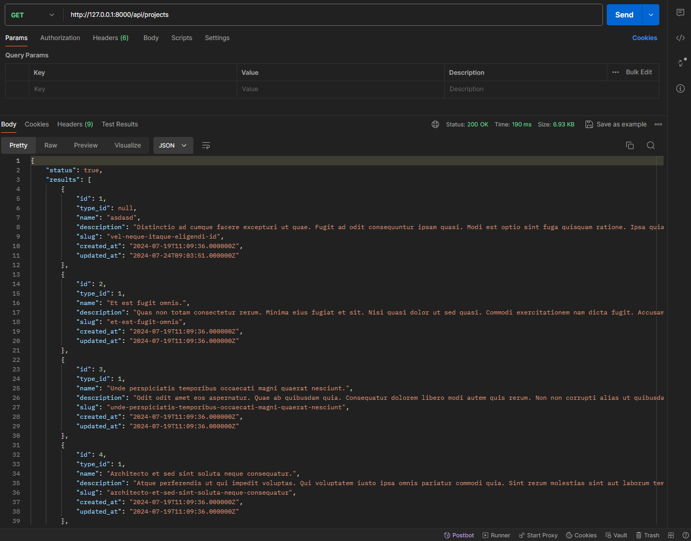
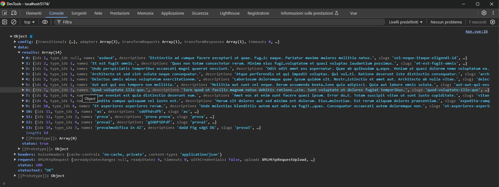
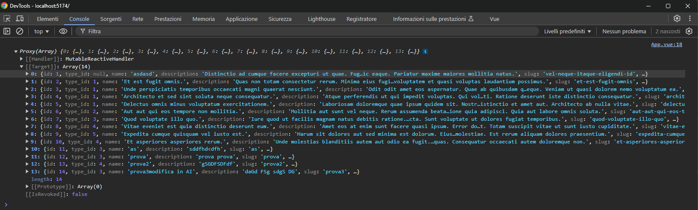
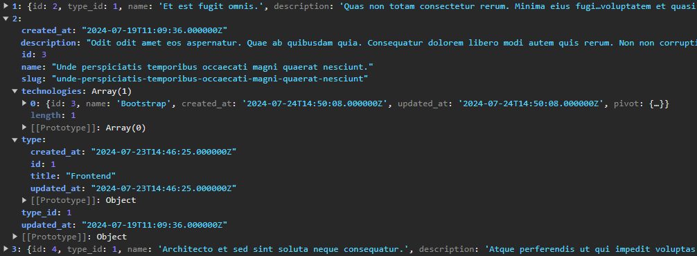

# Laravel Boolfolio - API

## Descrizione:

```txt
Continuiamo a lavorare sul codice dei giorni scorsi, ma in una nuova repo.
L’esercizio di oggi è suddiviso in milestone ed è importante che ne seguiate l’ordine.
```

### Milestone 1 &check;

- [&check;] Nome repo 1: laravel-api
- [&check;] Aggiungiamo al nostro progetto Laravel una nuovo Api/ProjectController. Questo controller risponderà a delle richieste via API e si occuperà di restituire la lista dei progetti presenti nel database in formato json.

### Milestone 2 &check;

- [&check;] Testiamo la chiamata API tramite Postman e assicuriamoci di ricevere i dati correttamente.



### Milestone 3 &check;

- [&check;] Nome repo 2: vite-boolfolio
- [&check;] Iniziamo ad occuparci della parte front-office della nostra applicazione: creiamo un nuovo progetto Vue 3 con Vite e installiamo axios.
- [&check;] Colleghiamo questo progetto ad una repo separata.

### Milestone 4 &check;

- [&check;] Nel componente principale della nostra Vue App facciamo una chiamata API all’endpoint costruito nel progetto Laravel (milestone 1) e recuperiamo tutti i progetti dal nostro back-end.
- [&check;] Stampiamo in console i risultati e verifichiamo di ricevere i dati correttamente.
  
  
  dati relazionati
  

### Milestone 5

- Creiamo un nuovo componente ProjectCard, che corrisponde ad una card per visualizzare un progetto. Utilizziamo questo componente per visualizzare tutti i progetti ricevuti tramite API.

### Bonus:

- Gestire la paginazione dei risultati
